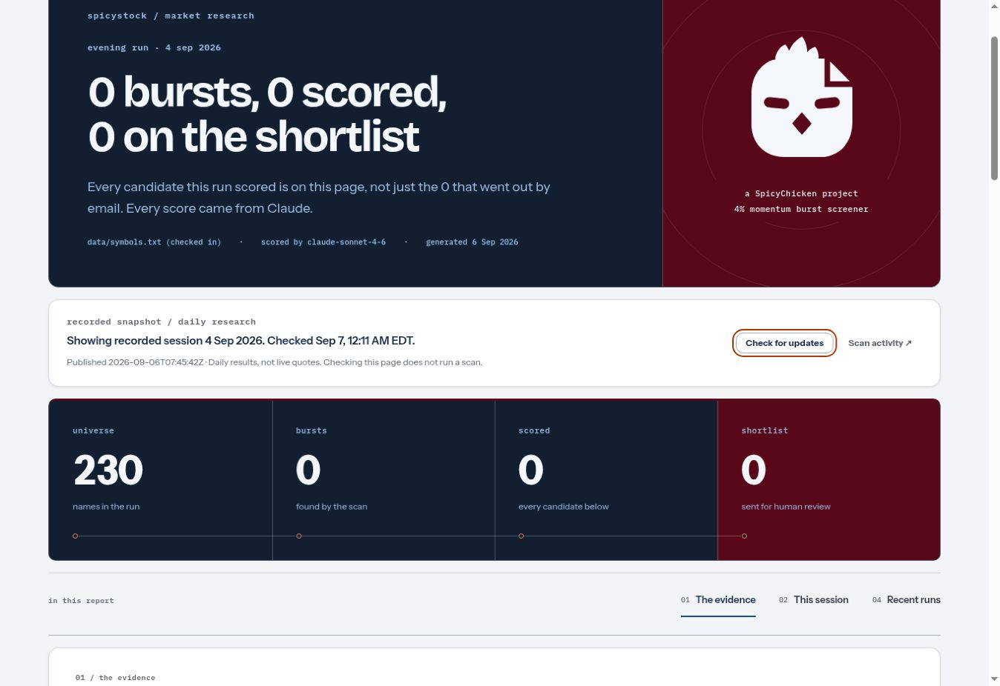

# SpicyStock — Tuesday readiness review

Reviewed 7 September 2026 for Tuesday, 8 September. This audit covers the
checked-in 228-stock research workflow: evening discovery, morning follow-through,
the retained record, and the public dashboard. It does not establish a trading edge.

## What will happen Tuesday

| Run | Scheduled time | What it can honestly provide |
| --- | --- | --- |
| Morning follow-through | 8:30 AM Eastern / 7:30 AM Central | Friday 4 September's recorded results, with their original session and provenance. No fresh scan or intraday data is fetched. |
| Evening discovery | 6:16 PM Eastern / 5:16 PM Central | Tuesday's completed daily bars, the unchanged 4% burst and 2LYNCH rules, scoring, archive, and ranked email. |
| Dashboard publication | After the evening workflow completes | An explicit Pages build followed by verification of the public HTML, snapshot and ledger against committed `main`. |

Monday 7 September is Labor Day, a scheduled market closure in the
[NYSE calendar](https://www.nyse.com/markets/hours-calendars).
The morning path deliberately has no holiday calendar: it will describe the
one-weekday gap from Friday as a possible closure or missing publication, with
a degraded notice. That notice must not be read as a new Tuesday scan.
The evening scanner uses broad observed bar history to recognize the previous
session, so Monday's closure does not reject every Tuesday symbol as gapped.
GitHub schedules can start later than their nominal time; Scan activity is the
execution record.

## Findings addressed

| Finding | Result |
| --- | --- |
| Weekend-only previous-session arithmetic rejected the day after a weekday holiday. | Integrated and independently reviewed the existing PR #20 observation-based fix, including the contrary-bar guard. Individual missing bars still count as missing data. |
| NaN or infinite current bars could produce a clean empty scan, or attach yesterday's checklist to today's burst. | Validate current OHLCV before detection. Entirely unreadable current data fails before scoring/publication; partial corruption participates in the existing degradation threshold. |
| Different explicit ticker baskets of the same size could be treated as the same scan. | Record and compare explicit symbol identity. Preserve the intentional same-session and full-universe protections. |
| Alpaca could wait without a socket timeout; the model SDK could retry invisibly inside application retries. | Client-scoped connection/read inactivity limits for Alpaca; explicit model connection/I/O limits with the existing application retry and marked fallback. |
| Bot commits do not trigger a Pages build. | A separate publication workflow requests the build and verifies the public files, including degraded or delivery-failed records that were successfully committed. No rehearsal artifacts are published. |
| An artifact from another branch, or a failed commit-back, could suppress the production cron. | Suppression requires this branch's artifact and a committed, same-session universe record. Missing receipts and API failures leave the scan enabled. |
| A stalled or failed browser fetch left no recovery path. | Fifteen-second request deadlines, retry for snapshot and record, manual update checking, retained complete reports after failed refresh, and protection against late ledger responses. |
| Zero-scored records could remain labelled as awaiting returns indefinitely. | Retained PR #20's truthful empty-evidence and no-scored-setup states. |

The dashboard now distinguishes the **recorded session** from the **last successful
check**. “Check for updates” fetches the published snapshot; it does not dispatch
a scan, call the scoring service or send email. It preserves the selected return
basis and expanded details when the file has not changed.

## Evidence

- Reviewed the existing operational work in
  [PR #20](https://github.com/spicyChicken59/SpicyStock/pull/20), then reconciled it
  with the deployed SpicyChicken design. The scan thresholds, strategy rulebook,
  symbol file, original logo and immutable shared design snapshot are unchanged.
- On 6 September,
  [run 34019987110](https://github.com/spicyChicken59/SpicyStock/actions/runs/34019987110)
  completed a live scan, received an email-service acceptance, and committed the
  4 September record. Service acceptance is not proof of inbox placement.
- On 6 September,
  [run 34050358796](https://github.com/spicyChicken59/SpicyStock/actions/runs/34050358796)
  rehearsed 26 May, the session after Memorial Day, using real data and scoring:
  228 symbols, nine bursts and four scored candidates, clean exit. Its dry-run
  setting suppressed email and commit-back. This audit inspected the execution
  log, not only the PR description.
- New regressions were demonstrated failing before their fixes. Targeted
  mutation checks exercised data validation, transport timeouts, publication,
  dashboard recovery and the existing holiday safeguards.
- Review covered phone, tablet and desktop layouts, light/dark themes, keyboard
  focus, retained report state, request failures and delayed response bodies.
  API tests use actual installed SDK request paths with network doubles.
- The combined gate collects 1,212 Python cases, exercises 214 original dashboard
  checks plus 32 recovery scenarios, regenerates both fixtures, and verifies all
  22 immutable shared design assets. GitHub CI runs the same required checks.

## Operating boundaries

The checked-in universe is 228 symbols. Full-market discovery remains a separate
open item: expanding it must preserve the biotech exclusion and reconsider the
universe-relative liquidity floor. Merely adding thousands of symbols changes
what the existing percentile admits.

The live record currently contains one zero-scored session. It cannot support a
claim that the rankings outperform alternatives. The two return bases and the
recorded comparison populations remain available as real observations accumulate.

Transport limits are connection/I/O inactivity limits, not a total wall-clock
deadline for a slow response that keeps delivering bytes. The workflow retains
its overall time limit. A publication failure is visible separately from scan
and delivery outcomes; the committed record remains available in the repository.

No trade was placed, production email dispatched, credential changed, release
tag published, or historical result replaced during this audit.

## Deployed verification

[PR #20](https://github.com/spicyChicken59/SpicyStock/pull/20) was merged as
`7b2d1209fc93f2d95f1144a8803084266f5cefae` after the required checks passed:
1,211 Python cases passed and one was skipped; all 214 original dashboard checks
and 32 recovery checks passed.

The [publication run](https://github.com/spicyChicken59/SpicyStock/actions/runs/34082105905)
successfully requested a Pages build and, at 04:10:58 UTC on 7 September 2026,
verified that the public `index.html`, `data.json` and `ledger.json` matched
committed main byte-for-byte. This exercised the real publication permissions,
not only the test doubles.

On the [live dashboard](https://spicychicken59.github.io/SpicyStock/), activating
**Check for updates** with Enter completed successfully and retained keyboard
focus on the button. The recorded session remained 4 September; a successful
refresh did not invent a newer scan. The screenshot below captures that finished
refresh, including the visible focus ring and original SpicyChicken mark.
Its historical universe count of 230 belongs to the preserved September record;
the current checked-in basket contains 228 symbols.

