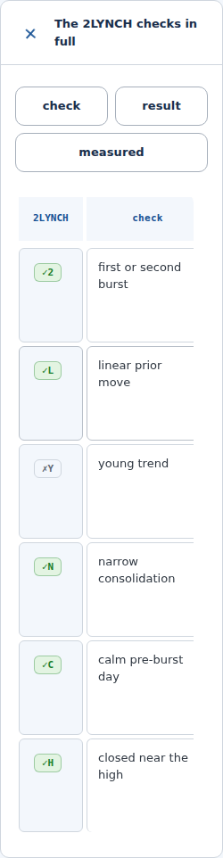

# Checklist criterion navigation

Shortlisted candidates already have native 2LYNCH signal tables. The checked-in
design presentation bundle adds optional Check, Result and Measured buttons when
those tables overflow. The check code stays pinned beside the requested column.
Disclosure controls, swiping and keyboard scrolling still work. Check labels,
results, measured values, scores and return calculations remain unchanged.

The original dashboard suite remains unchanged. Run the additional design check:

```bash
node tools/matrix_navigation_smoke.mjs --shots /tmp/stock-matrix-proof
```

It requires Playwright 1.56.1 with Chromium and runs 15 independent checks covering
390, 820 and 1280 pixels in both themes, native disclosures, exact source values,
return-basis rerenders, independent checklists, keyboard focus, reduced motion,
forced colors and navigation without the optional helper.



This screenshot uses the repository's canonical `tests/fixtures/data.json`,
Chromium at a 390-pixel viewport and offline fallback fonts. It is illustrative
test content, not live results, recommendations or trades. The public feed had
no shortlisted candidates during review on 6 September 2026.

The design snapshot's upstream commit and file hashes are recorded in
[`../design-system/provenance.json`](../design-system/provenance.json).
