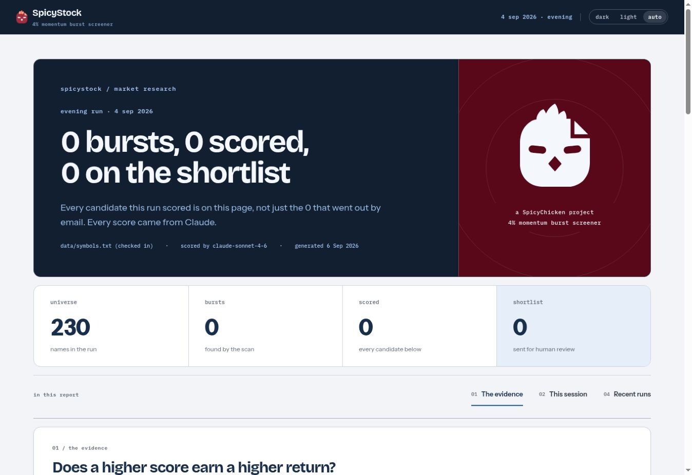
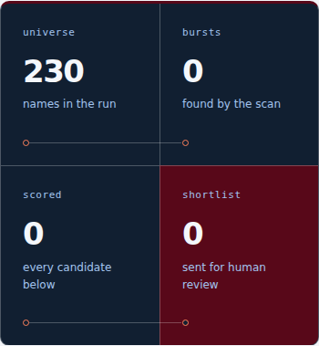
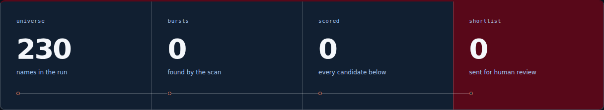

# The opening instrument deck

The existing run summary now reads as four connected stations: universe, bursts,
scored and shortlist. Larger type, an ink surface and a wine final station give
the opening a deliberate SpicyChicken identity. Hollow marks and connecting
lines express stage order; they do not indicate progress, success or live market
activity. The quantitative five-stage funnel remains the detailed explanation.

The recorded September 4, 2026 run still reads **230 / 0 / 0 / 0**. No sample
results replace those zeros. Native definition-list labels, notes and reading
order are unchanged. Phone stations form two successive pairs; a connector never
crosses from the right edge of one row to the left edge of another.

Implementation is presentation-only: `stock.css` imports `stock-studio.css`,
which supplies shared `--sc-stat-*` hooks to the existing `#run-strip`. The same
shared instrument and route recipes can be used by website and report authors
without the SpicyStock application. The original logo geometry, palette, HTML,
data and calculation code remain unchanged. The immutable shared source and
hashes are recorded in [snapshot provenance](../design-system/provenance.json).

## Visual proof

The public desktop before image was captured September 7, 2026, from deployed
SpicyStock main `b87b6a1820b88de53748436c1bf0b42d8fcfb406`.



The following cropped after images are local Chromium renders of the same
checked-in real run at 390 and 1280 pixels. External fonts are unavailable in
the offline review, so these show the page's font fallbacks.




## Verification

```bash
node tools/instrument_deck_smoke.mjs --shots /tmp/stock-instrument-proof
node tools/dashboard_smoke.mjs
python tools/check_fixture_fresh.py
```

The standalone design review requires Playwright with Chromium. It passes
20 checks: unchanged recorded facts and native semantics; readable text contrast,
layout and connector wrapping at phone, tablet and desktop sizes in both themes;
320-pixel fit; keyboard theme focus; forced colors; print; reduced motion; static
routes with ordinary motion preferences; and the canonical populated fixture.
Fixture content stays explicitly labelled and is used only in verification.

The existing dashboard suite passes **206/206 checks with zero page errors**;
its original test file is unchanged. Fixture freshness also passes. No animations
or interactions are introduced by this presentation layer.
